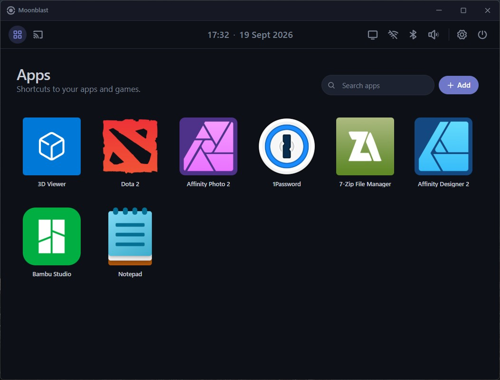

# Moonblast



Moonlight meets Xbox Fullscreen Experience. A lightweight launcher focused on simple apps launching and streaming using [Moonlight](https://moonlight-stream.org/).

My main goal is to have lightweight desktop replacement on my streaming only laptop.

This project is about 95% AI generated

## Features

- **Auto Immersive Mode** - Suppress default desktop and startup apps. Getting straight into Moonblast with minimal background processes
- **Apps** - Add and remove any app or shortcut to Apps page
  - Custom icon using local images or SteamGridDB (API key needed)
  - Configurable autolaunch apps
  - Known issue⚠️ - Some apps that require desktop shell might not work with Auto Immersive Mode
- **Moonlight** - Unified host list and streaming settings right in Moonblast. Moonblast drives the Moonlight CLI, doesn't reimplement the protocol
- **Tailscale** - Connect and disconnect
- **Device Controls**
  - **Wi-Fi**
  - **Bluetooth**
  - **Display**
  - **Battery**
  - **Audio**
- **Keyboard + controller support**
- **Theming and Customization** - Dark, Light and Auto Mode with customizable color palette

## Stack

- **Frontend**: React 19 + TypeScript + Tailwind
- **Backend**: Tauri 2 (Rust)
- WebView2 for the window
- Device controls run straight through native Win32/WinRT APIs - no daemons, no third-party SDKs

## Getting started

```bash
npm install
npm run tauri dev      # dev with hot reload
npm run tauri build    # production bundle
```

Prerequisites: Node 22+ (or Node 20.19+), Rust stable with the MSVC toolchain, Visual Studio 2022 C++ build tools, WebView2.

### ARM64 build

```bash
# one-time - ring needs clang for the ARM64 assembly
winget install LLVM.LLVM

# build
powershell -ExecutionPolicy Bypass -File scripts\build-arm64.ps1
powershell -ExecutionPolicy Bypass -File scripts\build-arm64.ps1 -Destination 'Z:\'
```

The helper locates Visual Studio via `vswhere.exe` and resolves `clang.exe` from your `PATH`, so it works across VS editions and LLVM install locations.

## Controls

| Action | Keys |
|---|---|
| Fullscreen | `F11` |
| Move focus | Arrows + D-Pad or Left Analog |
| Activate | `Enter` / `Space` / `(A)` |
| Close modal | `Escape` / `(B)` |
| Context menu | RMB / `Shift + F10` / `(X)` |

## Possible incompatibility

Due to my limited range of devices, I can only test this on:

- Ryzen 5800x PC (x64)
- Snapdragon X1 Laptop (ARM64)

## Licence

MIT. See [`LICENSE`](LICENSE).
